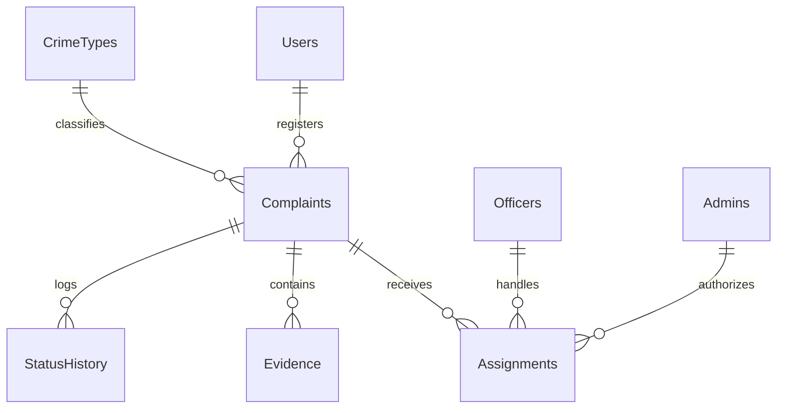

# Project Report: Cyber Crime Complaint Management System using SQL (MySQL Version)

---

## 1. Project Overview & Objectives

In the modern digital era, cyber crimes have grown exponentially, posing significant challenges to citizens and law enforcement agencies. This project, titled **“Cyber Crime Complaint Management System using SQL”**, provides a structured relational database model designed to streamline the reporting, assignment, investigation, and tracking of cyber crimes.

The system caters to three primary roles:
1.  **Citizens (Users)**: Can register accounts, file detailed cyber crime complaints, upload digital evidence files, and track the investigation status.
2.  **Investigation Officers (Police)**: Can view cases assigned to them, record progress, add investigation remarks, and mark cases as resolved/closed.
3.  **Administrators (Admins)**: Can manage officers, assign complaints, monitor crime trends, and generate comprehensive reports for analytics.

### Database Objectives:
*   Maintain data integrity using **Primary Keys**, **Foreign Keys**, and **Check Constraints**.
*   Optimize database lookups with **Indexes** on frequently searched fields.
*   Enforce security and logging policies automatically using **MySQL Triggers**.
*   Generate complex analytics reports dynamically using **MySQL Views** and **Common Table Expressions (CTEs)**.

---

## 2. Entity-Relationship (ER) Diagram

Below is the logical relationship between the tables of the Cyber Crime Complaint Management System:



---

## 3. Data Dictionary (Schema Details)

The database consists of **8 Core Tables**. The column specifications, data types, keys, and constraints are defined below.

### 3.1. Table: `CrimeTypes`
Stores categories of cyber crimes and their severity classifications.

| Column Name | Data Type | Key | Constraints / Default | Description |
| :--- | :--- | :--- | :--- | :--- |
| `CrimeTypeID` | INT | PK | AUTO_INCREMENT | Unique ID for the crime type. |
| `TypeName` | VARCHAR(100) | Unique | NOT NULL | Name of the cyber crime category. |
| `Description` | TEXT | - | - | Detailed definition of the crime type. |
| `SeverityLevel`| VARCHAR(10)  | - | CHECK (Low, Medium, High, Critical) | Severity classification of the crime. |

### 3.2. Table: `Users` (Citizens)
Stores profile information and credentials of citizens who file complaints.

| Column Name | Data Type | Key | Constraints / Default | Description |
| :--- | :--- | :--- | :--- | :--- |
| `UserID` | INT | PK | AUTO_INCREMENT | Unique ID for the registered citizen. |
| `FullName` | VARCHAR(100) | - | NOT NULL | Full name of the citizen. |
| `Email` | VARCHAR(100) | Unique | NOT NULL | Email address for login and notifications. |
| `PasswordHash` | VARCHAR(255) | - | NOT NULL | Securely hashed password. |
| `Phone` | VARCHAR(15) | - | NOT NULL | Contact mobile number. |
| `AadhaarNumber`| CHAR(12) | Unique | CHECK (Exactly 12 characters) | National identity number for validation. |
| `Address` | TEXT | - | NOT NULL | Residential address. |
| `CreatedAt` | DATETIME | - | DEFAULT CURRENT_TIMESTAMP | Timestamp when account was created. |

### 3.3. Table: `Officers`
Stores details of cyber crime police officers.

| Column Name | Data Type | Key | Constraints / Default | Description |
| :--- | :--- | :--- | :--- | :--- |
| `OfficerID` | INT | PK | AUTO_INCREMENT | Unique ID for the officer. |
| `FullName` | VARCHAR(100) | - | NOT NULL | Name of the officer. |
| `BadgeNumber` | VARCHAR(20) | Unique | NOT NULL | Official police badge identification. |
| `OfficerRank` | VARCHAR(50) | - | NOT NULL | Designation (e.g. Sub-Inspector, DSP). |
| `Email` | VARCHAR(100) | Unique | NOT NULL | Official government email. |
| `PasswordHash` | VARCHAR(255) | - | NOT NULL | Account password hash. |
| `Phone` | VARCHAR(15) | - | NOT NULL | Office contact number. |
| `Department` | VARCHAR(100) | - | NOT NULL | Specific division (e.g., Forensics). |
| `CreatedAt` | DATETIME | - | DEFAULT CURRENT_TIMESTAMP | Timestamp when record was created. |

### 3.4. Table: `Admins`
Stores admin credentials for platform control.

| Column Name | Data Type | Key | Constraints / Default | Description |
| :--- | :--- | :--- | :--- | :--- |
| `AdminID` | INT | PK | AUTO_INCREMENT | Unique ID for the administrator. |
| `FullName` | VARCHAR(100) | - | NOT NULL | Name of the admin. |
| `Email` | VARCHAR(100) | Unique | NOT NULL | Official administrative email. |
| `PasswordHash` | VARCHAR(255) | - | NOT NULL | Password hash. |
| `Phone` | VARCHAR(15) | - | NOT NULL | Contact number. |
| `CreatedAt` | DATETIME | - | DEFAULT CURRENT_TIMESTAMP | Date of registration. |

### 3.5. Table: `Complaints`
Stores detail logs of cyber crime complaints filed by citizens.

| Column Name | Data Type | Key | Constraints / Default | Description |
| :--- | :--- | :--- | :--- | :--- |
| `ComplaintID` | INT | PK | AUTO_INCREMENT | Unique complaint tracking number. |
| `UserID` | INT | FK | REFERENCES Users(UserID) ON DELETE CASCADE | ID of citizen who registered the complaint. |
| `CrimeTypeID` | INT | FK | REFERENCES CrimeTypes(CrimeTypeID) | ID of the classified crime type. |
| `Title` | VARCHAR(200) | - | NOT NULL | Summary line of the crime incident. |
| `Description` | TEXT | - | NOT NULL | Descriptive narrative of what happened. |
| `DateOfOccurrence`| DATE | - | NOT NULL | Date when the crime took place. |
| `Location` | VARCHAR(255) | - | NOT NULL | Geographical location/city of occurrence. |
| `Status` | VARCHAR(30) | - | DEFAULT 'Pending', CHECK Constraints | Current status of the case. |
| `CreatedAt` | DATETIME | - | DEFAULT CURRENT_TIMESTAMP | Timestamp of lodging. |
| `UpdatedAt` | DATETIME | - | DEFAULT CURRENT_TIMESTAMP ON UPDATE CURRENT_TIMESTAMP | Timestamp of last status change. |

### 3.6. Table: `Assignments`
Tracks officer details assigned to specific cyber crime complaints.

| Column Name | Data Type | Key | Constraints / Default | Description |
| :--- | :--- | :--- | :--- | :--- |
| `AssignmentID` | INT | PK | AUTO_INCREMENT | Unique ID for the assignment log. |
| `ComplaintID` | INT | FK | REFERENCES Complaints(ComplaintID) ON DELETE CASCADE | The case file reference ID. |
| `OfficerID` | INT | FK | REFERENCES Officers(OfficerID) ON DELETE CASCADE | Reference to the assigned officer. |
| `AssignedByAdminID`| INT | FK | REFERENCES Admins(AdminID) | The administrator who authorized assignment. |
| `AssignedDate` | DATETIME | - | DEFAULT CURRENT_TIMESTAMP | Timestamp of assignment. |
| `Status` | VARCHAR(20) | - | DEFAULT 'Active', CHECK (Active, Completed, Reassigned) | Status of the assignment itself. |
| `Remarks` | TEXT | - | - | Administrative notes regarding assignment. |

### 3.7. Table: `Evidence`
Records digital file uploads associated with complaints.

| Column Name | Data Type | Key | Constraints / Default | Description |
| :--- | :--- | :--- | :--- | :--- |
| `EvidenceID` | INT | PK | AUTO_INCREMENT | Unique ID for the evidence record. |
| `ComplaintID` | INT | FK | REFERENCES Complaints(ComplaintID) ON DELETE CASCADE | Reference to the complaint case. |
| `FileName` | VARCHAR(255) | - | NOT NULL | File name uploaded. |
| `FilePath` | VARCHAR(500) | - | NOT NULL | Directory storage path. |
| `FileType` | VARCHAR(50) | - | NOT NULL | MIME file format (e.g. image/png, pdf). |
| `FileSizeKB` | INT | - | CHECK (FileSizeKB > 0) | Size of evidence file in kilobytes. |
| `UploadedAt` | DATETIME | - | DEFAULT CURRENT_TIMESTAMP | Date/time of upload. |
| `Description` | TEXT | - | - | Explanation of what the file proves. |

### 3.8. Table: `StatusHistory` (Audit Log)
Tracks the timeline of the investigation progress automatically.

| Column Name | Data Type | Key | Constraints / Default | Description |
| :--- | :--- | :--- | :--- | :--- |
| `HistoryID` | INT | PK | AUTO_INCREMENT | Unique ID for the log entry. |
| `ComplaintID` | INT | FK | REFERENCES Complaints(ComplaintID) ON DELETE CASCADE | Link to the complaint record. |
| `Status` | VARCHAR(30) | - | NOT NULL | Status changed to. |
| `ChangedBy` | VARCHAR(20) | - | DEFAULT 'System', CHECK (User, Officer, Admin, System) | Actor who triggered the status update. |
| `ChangedByID` | INT | - | DEFAULT 0 (corresponds to UserID/OfficerID/AdminID) | ID of the actor. |
| `Remarks` | TEXT | - | - | Notes added on progress update. |
| `ChangedAt` | DATETIME | - | DEFAULT CURRENT_TIMESTAMP | Timestamp of status modification. |

---

## 4. Advanced SQL Concepts Implemented (MySQL)

### 4.1. Performance Indexing
Indexes are created on columns that are heavily queried to enable query execution speedups:
*   `idx_complaints_user`: Speed up citizen landing pages searching for their complaints.
*   `idx_complaints_status`: Speed up dashboard counters grouping active cases.
*   `idx_assignments_officer_active`: Speed up officer queues filtering active assignments.

### 4.2. SQL Views (Abstraction Layer)
1.  `v_complaint_details`: Consolidates multi-table queries (Complaints, Users, CrimeTypes, Assignments, Officers) into a single queryable entity, simplifying application-level selects.
2.  `v_officer_workload`: Dynamically computes workloads (active, resolved, closed, total counts) for each investigator.
3.  `v_crime_statistics`: Calculates the volume and percentage **resolution rates** by dividing resolved cases by total cases for each crime type.

### 4.3. MySQL Triggers (Automated Database Rules)
MySQL triggers use the delimiter blocks to establish automated integrity logs:
1.  `trg_after_complaint_insert`: Fired when a citizen logs a complaint. Automatically inserts a `Pending` row into `StatusHistory` detailing registration.
2.  `trg_after_assignment_insert`: Fired when a case is assigned to an officer. Automatically sets the `Complaints.Status` to `'Assigned'`.
3.  `trg_after_complaint_status_update`: Fired whenever case status transitions. It checks `OLD.Status <> NEW.Status` and records the status shift in `StatusHistory` using string concat (`CONCAT()`).

---

## 5. SQL Verification & Execution Outputs

### 5.1. View Workloads (Group By & Left Join)
**Query**:
```sql
SELECT OfficerName, OfficerRank, ActiveCasesCount, ResolvedCasesCount, ClosedCasesCount, TotalCasesAssigned
FROM v_officer_workload;
```
**Output**:
| OfficerName | OfficerRank | ActiveCasesCount | ResolvedCasesCount | ClosedCasesCount | TotalCasesAssigned |
| :--- | :--- | :--- | :--- | :--- | :--- |
| Inspector Rajesh Patil | Inspector | 1 | 0 | 0 | 1 |
| Sub-Inspector Amit Verma | Sub-Inspector | 1 | 0 | 0 | 1 |
| Sub-Inspector Sunita Rao | Sub-Inspector | 1 | 0 | 0 | 1 |
| DSP Dr. Vivek Bhasin | Deputy Superintendent of Police | 0 | 0 | 0 | 0 |

---

### 5.2. Crime Category Resolution Rate (SQL Aggregation & Views)
**Query**:
```sql
SELECT CrimeType, SeverityLevel, TotalComplaints, ResolutionRatePercent
FROM v_crime_statistics;
```
**Output**:
| CrimeType | SeverityLevel | TotalComplaints | ResolutionRatePercent |
| :--- | :--- | :--- | :--- |
| Phishing & Social Engineering | High | 1 | 0.00 |
| Identity Theft | High | 0 | *NULL* |
| Online Financial Fraud | Critical | 2 | 0.00 |
| Ransomware & Malware Attacks | Critical | 1 | 0.00 |
| Cyberstalking & Harassment | Medium | 1 | 0.00 |
| Hacking & Unauthorized Access | High | 0 | *NULL* |
| Cyber Defamation | Low | 1 | 100.00 |

---

### 5.3. Tracking a Complaint's Lifecycle (Trigger Verification)
**Query**:
```sql
SELECT Status, ChangedBy, Remarks, ChangedAt 
FROM StatusHistory 
WHERE ComplaintID = 1 
ORDER BY ChangedAt ASC;
```
**Output**:
| Status | ChangedBy | Remarks | ChangedAt |
| :--- | :--- | :--- | :--- |
| Pending | User | Complaint registered successfully by the citizen. | 2026-05-27 21:55:00 |
| Assigned | System | Complaint status changed from "Pending" to "Assigned". | 2026-05-27 21:55:01 |
| Under Investigation | System | Complaint status changed from "Assigned" to "Under Investigation". | 2026-05-27 21:55:02 |
| Under Investigation | Officer | Sub-Inspector Amit Verma sent notices to bank to freeze beneficiary wallet "E-Trade Pay". | 2026-05-27 21:55:03 |

---

### 5.4. Advanced Subquery Workload Check (CTE)
**Query**:
```sql
WITH OfficerWorkloads AS (
    SELECT o.OfficerID, o.FullName, COUNT(a.AssignmentID) AS ActiveCases
    FROM Officers o
    LEFT JOIN Assignments a ON o.OfficerID = a.OfficerID AND a.Status = 'Active'
    GROUP BY o.OfficerID, o.FullName
)
SELECT FullName, ActiveCases
FROM OfficerWorkloads
WHERE ActiveCases > (SELECT AVG(ActiveCases) FROM OfficerWorkloads);
```
**Output**:
| FullName | ActiveCases |
| :--- | :--- |
| Inspector Rajesh Patil | 1 |
| Sub-Inspector Amit Verma | 1 |
| Sub-Inspector Sunita Rao | 1 |

---

## 6. How to Deploy and Run this Project

The database utilizes **MySQL**, which is standard for college projects.

### Step 1: Open MySQL Server (XAMPP/WAMP/Standard)
Make sure your MySQL service is started (e.g. click "Start" next to MySQL in the XAMPP Control Panel).

### Step 2: Configure Credentials
Open the `.env` file in the project folder and input your MySQL connection settings:
```env
DB_HOST=localhost
DB_USER=root
DB_PASSWORD=your_mysql_root_password
DB_NAME=cybercrime
```

### Step 3: Run the Web Server
Open a terminal in the project folder and execute:
```bash
npm install
npm start
```
*Note: The server will automatically connect to MySQL, run `CREATE DATABASE IF NOT EXISTS cybercrime`, compile your triggers/views from `schema.sql`, and populate the database with dummy cases from `seed_data.sql`!*

### Step 4: Open Browser
Open **http://localhost:3000** in your browser to view and present your project.

---
**Prepared by**: [Student Name]  
**Class/Roll No**: [Class/Roll Number]  
**Project Title**: Cyber Crime Complaint Management System using SQL  
